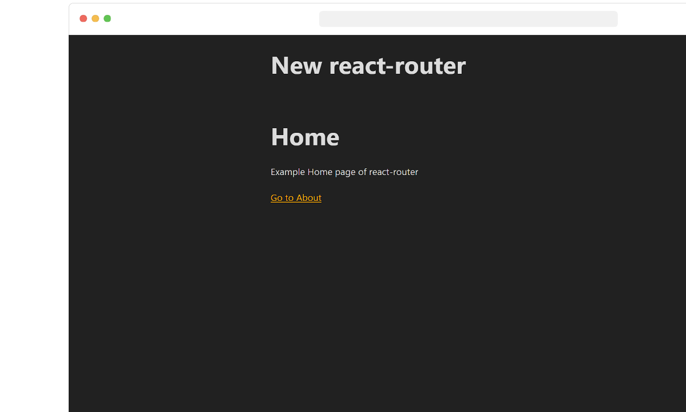

# React Router from scratch

🟥 **Español**

Creamos una implementación similar al paquete React-Router. Permite hacer MPAs (Multiple Page Application), SPAs (Single Page Applications). Permite navegar hacia atrás en el historial, incluye el componente Link y Router para hacerlo declarativo y muestra la ruta predeterminada 404, rutas con parametros, componentes de carga Lazy, rutas i18n, y testing.

🟦 **English**

We've developed a versatile routing solution akin to the React-Router package. It enables the creation of both MPAs (Multiple Page Applications) and SPAs (Single Page Applications), offers history navigation, provides declarative components like Link and Router, includes a default 404 route, supports parameterized routes, facilitates lazy loading of components, handles i18n routes, and we applied testing.

--- 

### Instructions:

- [x] Install linter
- [x] Create a way to make MPAs (Multiple Page Application)
- [x] Create a way to make SPAs (Single Page Applications)
- [x] Being able to navigate between pages with the back button
- [x] Create Link component to make it declarative
- [x] Create Router component to make it more declarative
- [x] Support default route (404)
- [x] Support routes with parameters
- [x] <Route /> component to make it declarative
- [x] Lazy Loading of routes
- [x] Make an i18n with the routes
- [x] Testing

@midudev react class 2023
